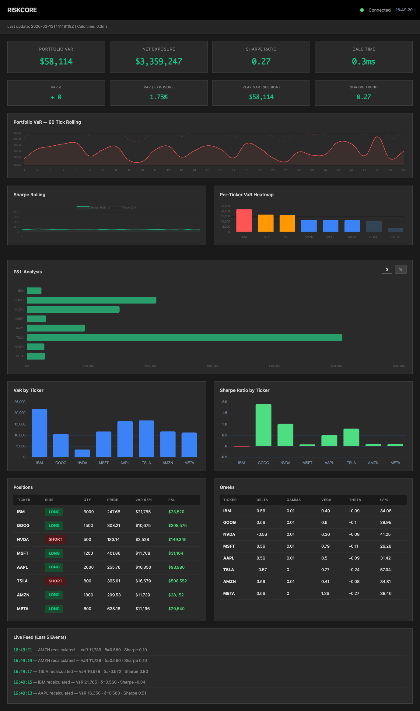
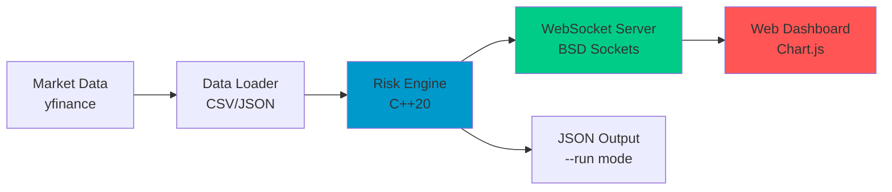
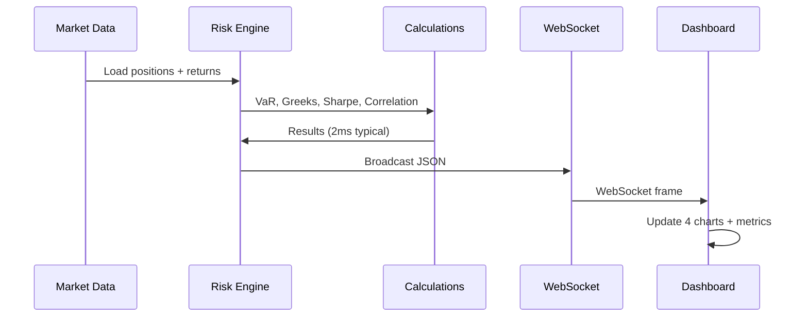

# riskcore-cpp


**High-performance C++ equity risk analytics engine** with real-time WebSocket streaming and live web dashboard. Compute 95% Value-at-Risk, Black-Scholes Greeks, and portfolio metrics with **sub-millisecond latency**.



## Overview

riskcore-cpp delivers institutional-grade portfolio risk analytics:
- **95% Historical VaR** (1-day, per position and portfolio)
- **Black-Scholes Greeks** (delta, gamma, vega, theta for ATM options)
- **Sharpe Ratio** (annualized with 4.5% risk-free rate)
- **Variance-Covariance Portfolio VaR** with Pearson correlation matrix
- **Real-time Dashboard** with 4 interactive chart panels and live metrics

## System Architecture



## Computation Pipeline



## Features

| Feature | Details |
|---------|---------|
| **Risk Metrics** | VaR 95%, Greeks, Sharpe, correlation, P&L tracking |
| **Performance** | Sub-millisecond computation, 60-tick rolling history |
| **Real-time Updates** | 2-second refresh cycle via WebSocket |
| **Interactive UI** | Dark theme, responsive layout, 4 live charts |
| **Data Pipeline** | yfinance → CSV/JSON → C++ engine |
| **Portability** | C++20, zero external math libraries, STL only |

## Quick Start

### Prerequisites
```bash
brew install cmake libwebsockets pkg-config openssl
curl -LsSf https://astral.sh/uv/install.sh | sh
```

### Build & Run
```bash
git clone https://github.com/nim444/riskcore-cpp.git && cd riskcore-cpp

# Fetch market data
uv run scripts/fetch_data.py

# Build
cmake -B build -DCMAKE_BUILD_TYPE=Release
cmake --build build --parallel

# Single computation (JSON output)
./build/riskcore --run

# Live dashboard (2 terminals):
# Terminal 1:
./build/riskcore --serve

# Terminal 2:
python3 -m http.server 8000 --directory web
# Open http://localhost:8000
```

## Dashboard Panels

1. **Portfolio VaR Trend** — 60-point rolling window with dynamic Y-axis zoom
2. **Sharpe Rolling** — Real-time ratio with 0.5 target reference line
3. **VaR Heatmap** — Per-ticker risk sorted by impact (4-tier colour contrast)
4. **P&L Analysis** — Dollar or percentage mode toggle (all 8 positions readable)

## Technology Stack

| Layer | Technology |
|-------|-----------|
| **Core** | C++20, STL algorithms, BSD sockets |
| **Build** | CMake 3.20+, clang++ (Apple Silicon) |
| **Backend** | libwebsockets, OpenSSL, nlohmann/json |
| **Frontend** | Vanilla JS, Chart.js, CSS3 |
| **Data** | Python, yfinance, uv |

## Configuration

### Custom Tickers
Edit `scripts/fetch_data.py`:
```python
tickers = ["IBM", "GOOG", "NVDA", "MSFT", "AAPL", "TSLA", "AMZN", "META", "YOUR_TICKER"]
position_config = {"YOUR_TICKER": {"side": "LONG", "quantity": 1000}}
```

Then: `uv run scripts/fetch_data.py && cmake --build build --parallel && ./build/riskcore --serve`

## CLI Reference

```bash
./build/riskcore --run       # Compute once, output JSON
./build/riskcore --serve     # Start WebSocket server (port 8080)
./build/riskcore --version   # Show version
```

## Troubleshooting

| Issue | Solution |
|-------|----------|
| WebSocket won't connect | Ensure `./build/riskcore --serve` is running on port 8080 |
| Dashboard shows "undefined" | Verify web server runs on port 8000 |
| Port conflict | `lsof -i :8080` to find process |
| $0 prices | Run `uv run scripts/fetch_data.py` to fetch data |

## License

MIT License – See LICENSE file
