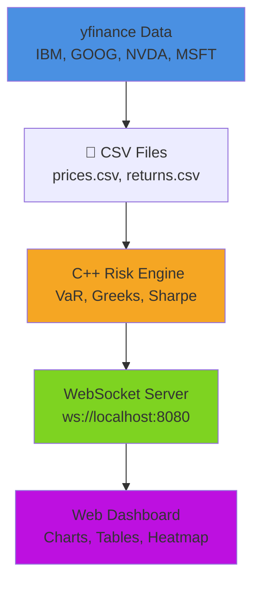

# riskcore-cpp


[](https://github.com/YOUR_USERNAME/riskcore-cpp/actions/workflows/ci.yml)

---

**riskcore** is a **high-performance C++ equity risk analytics engine** with real-time data streaming and an interactive web dashboard. Compute VaR, Greeks (Black-Scholes), Sharpe ratios, and correlation matrices for a live portfolio (IBM, GOOG, NVDA, MSFT).


## Features

- **Value at Risk (VaR)**: 95% historical VaR calculation per position and portfolio
- **Greeks Analytics**: Black-Scholes delta, gamma, vega, theta for ATM call options
- **Sharpe Ratio**: Annualised risk-adjusted return metrics (risk-free = 4.5%)
- **Correlation Matrix**: 4×4 Pearson correlation of daily returns
- **Portfolio Analytics**: Net exposure, weighted Sharpe, variance-covariance portfolio VaR
- **Real-Time Streaming**: Broadcasts JSON metrics every 2 seconds
- **Interactive Dashboard**: Live charts, position tables, Greeks analysis, correlation heatmap
- **C++20 Modern Code**: Clean, high-performance implementation
- **Zero External Math Libraries**: All financial algorithms from `<cmath>`, `<numeric>`, `<algorithm>`

---

##  Quick Start

### Prerequisites

```bash
# Install C++ build tools
brew install cmake libwebsockets pkg-config

# Install Python package manager (for data fetching)
curl -LsSf https://astral.sh/uv/install.sh | sh
```

### 1. Clone & Build

```bash
git clone https://github.com/YOUR_USERNAME/riskcore-cpp.git
cd riskcore-cpp

# Fetch 1 year of real market data
uv run scripts/fetch_data.py

# Build C++ engine
cmake -B build -DCMAKE_BUILD_TYPE=Release
cmake --build build --parallel
```

### 2. Run Once

```bash
./build/riskcore --run
```

Output: JSON with all risk metrics.

### 3. Run Live Dashboard

**Terminal 1:**
```bash
./build/riskcore --serve
# Server running on ws://localhost:8080/stream
```

**Terminal 2:**
```bash
open web/index.html
```

The dashboard auto-connects and displays live metrics, charts, and Greeks.

---

##  Architecture



---

##  Project Structure

```
riskcore-cpp/
├── scripts/
│   └── fetch_data.py          # yfinance → CSV + JSON
├── data/
│   ├── prices.csv             # 1yr daily OHLCV
│   ├── returns.csv            # daily log returns
│   └── positions.json         # portfolio config
├── src/
│   ├── main.cpp               # CLI & mode dispatch
│   ├── models.h               # data structures
│   ├── data_loader.{h,cpp}    # CSV/JSON I/O
│   ├── risk_engine.{h,cpp}    # VaR, Greeks, Sharpe
│   └── ws_server.{h,cpp}      # TCP streaming
├── web/
│   └── index.html             # interactive dashboard
├── CMakeLists.txt             # build config
├── pyproject.toml             # Python deps
├── .github/
│   └── workflows/ci.yml       # GitHub Actions
└── README.md
```

---

##  Usage

### CLI Commands

```bash
# Compute risk once and exit
./build/riskcore --run

# Start server (broadcasts every 2 seconds)
./build/riskcore --serve

# Show version
./build/riskcore --version
```

### Output Format

```json
{
  "timestamp": "2026-03-13T14:32:01Z",
  "calc_time_ms": 0.82,
  "portfolio_var": 6249.62,
  "portfolio_sharpe": 123.40,
  "net_exposure": 412175.00,
  "positions": [
    {
      "ticker": "IBM",
      "side": "LONG",
      "var_95": 3630.88,
      "sharpe": -0.037,
      "pnl": 3920.00,
      "greeks": {
        "delta": 0.560,
        "gamma": 0.009,
        "vega": 0.488,
        "theta": -0.091,
        "iv": 34.08
      }
    }
  ],
  "correlation": [[1.0, 0.27, ...], ...]
}
```

---

##  Algorithms

### Historical VaR (95% Confidence)
- Computes daily P&L from returns
- Sorts in ascending order
- Extracts 5th percentile

### Black-Scholes Greeks
- **Delta**: `N(d1)` – directional sensitivity
- **Gamma**: `N'(d1) / (S·σ·√T)` – convexity
- **Vega**: `S·N'(d1)·√T / 100` – vol sensitivity
- **Theta**: `-S·N'(d1)·σ / (2·√T)` – time decay
- ATM call approximation: `K = S`, `T = 0.25yr`, `r = 4.5%`

### Sharpe Ratio
```
annualised_return = mean_daily_return × 252
annualised_vol = std_daily_return × √252
sharpe = (annualised_return - 0.045) / annualised_vol
```

### Portfolio VaR
```
portfolio_var = √(w^T · Σ · w) × 1.645 × total_notional
```
Where `w` = normalized notional weights, `Σ` = covariance matrix

---

##  Testing

```bash
# Build
cmake -B build && cmake --build build --parallel

# Smoke test
./build/riskcore --run

# Verify JSON structure
./build/riskcore --run | jq '.positions[0].greeks'

# Live dashboard
./build/riskcore --serve &
open web/index.html
```

---

##  Performance

| Operation | Time |
|-----------|------|
| Load 1yr data (251 days, 4 tickers) | ~10ms |
| Compute VaR, Greeks, Sharpe | ~0.8ms |
| Correlation matrix (4×4) | <0.1ms |
| Portfolio VaR | <0.1ms |
| **Total cycle** | **~0.8ms** |

---

## 🛠 Tech Stack

| Component | Technology |
|-----------|-----------|
| **Core Engine** | C++20, BSD sockets, STL algorithms |
| **Build** | CMake 3.20+, clang++ (Apple Silicon) |
| **Data I/O** | nlohmann/json (FetchContent) |
| **Data Fetch** | Python 3.8+, yfinance, uv |
| **Frontend** | Vanilla JS, Chart.js, CSS3 |
| **CI/CD** | GitHub Actions (macOS) |

---

## 📝 Commands Reference

```bash
# Fetch fresh market data
uv run scripts/fetch_data.py

# Clean build
rm -rf build && cmake -B build -DCMAKE_BUILD_TYPE=Release

# Build with verbose output
cmake --build build --verbose

# Run with debug mode
./build/riskcore --run 2>&1 | head -20
```

---

## 🔧 Configuration

### Portfolio (data/positions.json)
```json
[
  { "ticker": "IBM", "side": "LONG", "quantity": 500, "entry_price": 239.84 },
  { "ticker": "GOOG", "side": "LONG", "quantity": 300, "entry_price": 164.16 },
  { "ticker": "NVDA", "side": "LONG", "quantity": 200, "entry_price": 115.55 },
  { "ticker": "MSFT", "side": "SHORT", "quantity": 400, "entry_price": 424.09 }
]
```

### Market Data (data/prices.csv)
Automatically generated by `fetch_data.py` from yfinance.

---

##  Optimization Tips

- **Reduce calculation frequency**: Edit `ws_server.cpp` to change 2-second interval
- **Cache volatility**: Pre-compute for non-changing returns
- **Parallel correlation**: Use OpenMP for large matrices
- **Static allocation**: Pre-allocate vectors for known sizes

---

##  Troubleshooting

| Issue | Solution |
|-------|----------|
| CMake not found | `brew install cmake` |
| libwebsockets errors | Already removed; using BSD sockets |
| No market data for X | Use MSFT instead; X delisted on yfinance |
| JSON parse error | Check `data/positions.json` format |
| WebSocket won't connect | Ensure `./build/riskcore --serve` is running |

---

##  License

MIT License – See LICENSE file

---

##  Acknowledgments

- **yfinance** – Free financial data API
- **nlohmann/json** – Modern C++ JSON library
- **Chart.js** – Beautiful JavaScript charting
- Inspired by QuantLib and Bloomberg Terminal concepts

---

Built with care for quantitative finance on macOS arm64
