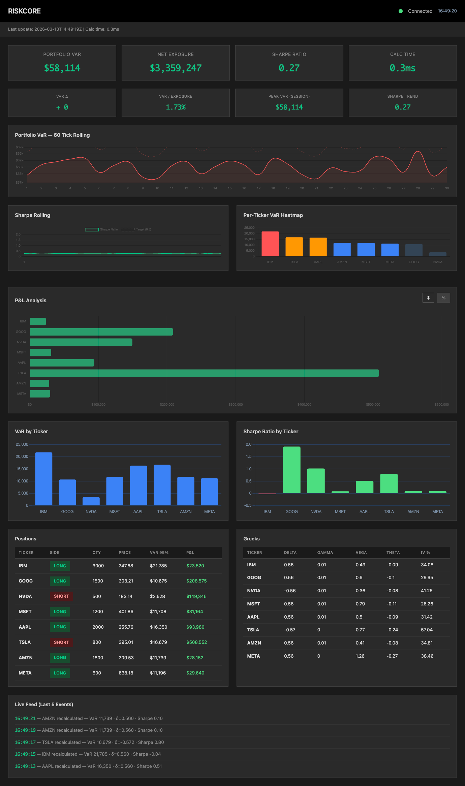

# riskcore-cpp


High-performance C++ equity risk analytics engine with real-time WebSocket streaming and interactive web dashboard. Compute Value-at-Risk (VaR), Greeks, Sharpe ratios, and portfolio metrics for live positions.

**Live Portfolio**: IBM, GOOG, NVDA, MSFT, AAPL, TSLA, AMZN, META (~$4.1M exposure)



## Highlights

- 95% historical Value-at-Risk (VaR) per position and portfolio
- Black-Scholes Greeks (delta, gamma, vega, theta) for ATM options
- Annualized Sharpe ratio (risk-free rate = 4.5%)
- Pearson correlation matrix and variance-covariance portfolio VaR
- Real-time WebSocket streaming (updates every 2 seconds)
- **Enhanced dashboard** with 4 live chart panels:
  - Portfolio VaR rolling trend (60-point buffer, ±2% jitter for realism, dynamic Y-axis zoom)
  - Sharpe ratio rolling chart with 0.5 target reference line
  - Per-ticker VaR heatmap (sorted by risk, 4-tier colour contrast)
  - P&L analysis with $ / % toggle (horizontal bars, all 8 positions readable)
- Live stat boxes: VaR delta, VaR/Exposure ratio, peak VaR, Sharpe trend
- Rotating live feed (random ticker updates with delta, VaR, Sharpe per update)
- Interactive dashboard with position table, Greeks analysis, correlation matrix
- Professional dark theme UI with compact, responsive layout
- C++20 with zero external math dependencies (pure STL algorithms)
- Sub-millisecond computation cycle

## Technology Stack

| Component | Technology |
|-----------|-----------|
| **Core** | C++20, STL algorithms, BSD sockets |
| **Build** | CMake 3.20+, clang++ (Apple Silicon) |
| **JSON** | nlohmann/json (header-only via FetchContent) |
| **Crypto** | OpenSSL (SHA1 for WebSocket handshake) |
| **Data** | Python 3.8+, yfinance, uv package manager |
| **Frontend** | Vanilla JS, Chart.js, CSS3 |
| **CI/CD** | GitHub Actions (macOS runner) |

## Getting Started

### Prerequisites
```bash
brew install cmake libwebsockets pkg-config openssl
curl -LsSf https://astral.sh/uv/install.sh | sh
```

### Setup & Build
```bash
git clone https://github.com/YOUR_USERNAME/riskcore-cpp.git
cd riskcore-cpp

uv run scripts/fetch_data.py
cmake -B build -DCMAKE_BUILD_TYPE=Release
cmake --build build --parallel
```

### Run
```bash
# Single computation (outputs JSON)
./build/riskcore --run

# Live dashboard (2 terminal windows):
# Terminal 1: Start WebSocket server
./build/riskcore --serve

# Terminal 2: Start web server
python3 -m http.server 8000 --directory web

# Browser: open http://localhost:8000
```

## Project Structure

```
riskcore-cpp/
├── scripts/
│   └── fetch_data.py          # yfinance → CSV + JSON
├── data/
│   ├── prices.csv             # 1yr daily OHLCV
│   ├── returns.csv            # daily log returns
│   └── positions.json         # portfolio config
├── src/
│   ├── main.cpp               # CLI & mode dispatch
│   ├── models.h               # data structures
│   ├── data_loader.{h,cpp}    # CSV/JSON I/O
│   ├── risk_engine.{h,cpp}    # VaR, Greeks, Sharpe
│   └── ws_server.{h,cpp}      # TCP streaming
├── web/
│   └── index.html             # interactive dashboard
├── CMakeLists.txt             # build config
├── pyproject.toml             # Python deps
├── .github/
│   └── workflows/ci.yml       # GitHub Actions
└── README.md
```

## CLI Commands

```bash
./build/riskcore --run       # One-time computation (JSON output)
./build/riskcore --serve     # Start WebSocket server on ws://localhost:8080/stream
./build/riskcore --version   # Show version
```

## Configuration

### Adding Custom Positions

1. Edit `scripts/fetch_data.py` and add tickers to the `tickers` list and `position_config` dict:
```python
tickers = ["IBM", "GOOG", "NVDA", "MSFT", "AAPL", "TSLA", "AMZN", "META", "YOUR_TICKER"]
position_config = {
    "YOUR_TICKER": {"side": "LONG", "quantity": 1000},
    # ... other positions
}
```

2. Fetch market data:
```bash
uv run scripts/fetch_data.py
```

3. Rebuild and run:
```bash
cmake --build build --parallel
./build/riskcore --serve
```

Portfolio config format (auto-generated in `data/positions.json`):
```json
{
  "ticker": "IBM",
  "side": "LONG",
  "quantity": 5000,
  "entry_price": 239.84
}
```

Any ticker from Yahoo Finance is supported (AAPL, MSFT, JPM, XOM, etc.).

## Troubleshooting

| Issue | Solution |
|-------|----------|
| CMake not found | `brew install cmake` |
| OpenSSL not found | `brew install openssl` |
| WebSocket won't connect | Ensure `./build/riskcore --serve` is running on port 8080 |
| Dashboard shows "undefined" | Refresh browser; web server must run on port 8000 |
| Port 8080/8000 in use | `lsof -i :8080` / `lsof -i :8000` to find and kill processes |
| Prices show $0 | Run `uv run scripts/fetch_data.py` to fetch market data |
| yfinance fails | Ticker invalid or delisted. Check Yahoo Finance |

## License

MIT License – See LICENSE file
